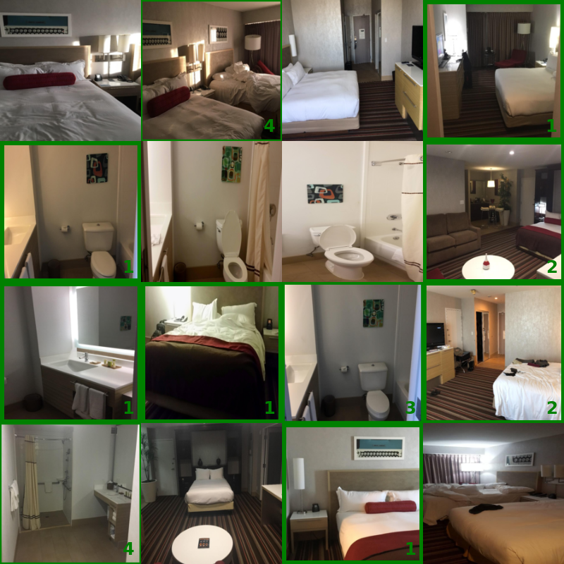

Hotel-ID to Combat Human Trafficking 2021 - FGVC8
===



Official competition on [Kaggle](https://www.kaggle.com/competitions/hotel-id-2021-fgvc8/data).

To help in situations of human trafficking, we present several models for hotel and hotel-chain classification from an input image of a hotel-room. We propose an approach other than standard ResNet [3] classification by using triplet learning for feature embedding to encounter the low amount of image-data for some hotels. Evaluation on the Traffick- Cam [1] dataset shows, that this is superior to standard ResNet. We also did a late submission of our model to the Kaggle Challenge [1] and would have reached place 35 out of 92 competitors.

Getting Started
---

1.  Setup conda environment 

    ```bash
    > conda env create -f environment.yaml
    > conda activate hotel-id-nns
    ```

2. Install `hotel-id-nns` package

    ```bash
    > pip install .
    ```

    For development, this package should be installed as pip editable installation. This requires pip version 22.*
    ```bash
    > pip install -e . --config-settings editable_mode=compat --no-deps
    ```

    *Note: the argument `config-settings editable_mode=compat` fixes some linter issues.*

3. Setup Dataset

    1. Go to [Kaggle](https://www.kaggle.com/competitions/hotel-id-2021-fgvc8/data) and download the dataset zip
    1. Extract it to `data/dataset`. The directory structure should look like this:
        ```bash
        data/
        └──dataset/
            ├──test_images/
            ├──train_images/
            ...
            ├──hotel-id-2021-fgvc8.zip
            ├──sample_submission.csv
            └──train.csv
        ```
        **Note: all following scripts assume this file structure**

    1. Execute [hotel_id_nns/tools/csv_to_h5_converter.py](hotel_id_nns/tools/csv_to_h5_converter.py) 
    
        This will generate `.h5` files for each train-val-test `.csv` file.

4. Download checkpoints

    All checkpoints are saved in `git-lfs`. To get them execute following commands

    ```bash
    > git lfs install
    > git lfs pull
    ```

Folder Structure
---

```bash
├─data/
│  ├─checkpoints/ # all checkpoints
│  │  ├──chain-id/ # chain-id ResNet50 checkpoint
│  │  ├──hotel-id/ # hotel-id checkpoints for ResNet50 and triplet based classifier
│  │  └──image-net/ # image-net weights from torchvision, adapted to our model implementation
│  ├──configs/ # all configuration files for training
│  └──dataset/ # contains the FGVC8 dataset
├─docs/ # documentation
│  └──slurm/ # files for bwunicluster
│  └──Roadmap.md # our development roadmap for chain-id and hotel-id prediction
├─hotel_id_nns/ # the actual python package containing our implementation
├─report/ # the praktikum report
├─tests/ # some tests
...
```

Regenerate Dataset-Splits
---

To generate the `.csv` train-val-test splits, execute the Jupyter notebook at [hotel_id_nns/tools/train_val_test_split.ipynb](hotel_id_nns/tools/train_val_test_split.ipynb). Just execute each cell.
This will overwrite the `.csv` files in `data/dataset`.
The generated train, val and test files (.csv) contain rows in the format `image-path,chain-idx,hotel-idx` where chain-idx is the index of the class-label which are listed in `chain_id_mapping.csv` file (Analog for the hotel-idx). 

Checkpoints
---
All checkpoints are stored in git-lfs under [data/checkpoints](data/checkpoints). The `README.md` there contains more information on the various checkpoints.

Training
---

All trainings require a configuration file in `.json` format.
One can look at the `.json` configs in data/config\_files for inspiration how training works.

The optional parameter `--data-path` can be used to specify where the dataset files and folders are stored at.
If not given, the script assumes that the files are located under data/dataset.

`-m` can be used to overwrite the `model_name` parameter, which determines the model that should be used for training.


### Train chain-id prediction network

```bash
> python hotel_id_nns/scripts/train_classification.py data/configs/train_chain_id.json
```

### Train hotel-id prediction network

```bash
> python hotel_id_nns/scripts/train_classification.py data/configs/train_hotel_id.json 
```
### Train hotel-id feature extractor with triplet learning

```bash
> python hotel_id_nns/scripts/train_triplet_hotel_id.py data/configs/train_hotel_id_triplet_cosine.json
```

Testing
---

### Test classification

To test the classification models on the test set, the script at [hotel_id_nns/scripts/inspect_model.py](hotel_id_nns/scripts/inspect_model.py) can be used. 
This script will compute the accuracy, precision, recall, f1-score mAP@5 metric and also display the confusion matrix.

### Test triplet learning

The triplet learning can be tested with [hotel_id_nns/scripts/inspect_model-triplet.py](hotel_id_nns/scripts/inspect_model-triplet.py).
This requires the means for each hotel-id class, which can be computed with [hotel_id_nns/scripts/triplet_class_mean.py].

Run Sweep [https://docs.wandb.ai/guides/sweeps](https://docs.wandb.ai/guides/sweeps)
---

1. Initialize Sweep

```bash
wandb sweep --project chain-id --entity hotel-id-nns data/configs/chain_id_sweep.yaml
```

2. Start Sweep Agents

    1. BwUniCluster

        Ensure the .sh file is set up correctly

        ```bash
            sbatch docs/slurm/train_sweep.sh
        ```

    2. CLI

        ```bash
        wandb agent hotel-id-nns/chain-id/<<SWEEP-ID>>
        ```